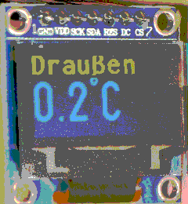

# wireless-tempdisplay
ESP displays temperature

For this project, I'm using [PlatformIO](https://platformio.org/) to program a
Wemos D1 mini

using the [Arduino](https://www.arduino.cc/) framework
[for the ESP8266](https://github.com/esp8266/Arduino).

For the display, I'm using a 128x64 OLED display

for displaying the temperature.

## Wiring
The display is connected to the Wemos D1 mini like this:

| Display Pin | Wemos Pin |
| ----------- | --------- |
| GND         | GND       |
| VDD         | 3V3       |
| SCK         | D5        |
| SDA         | D7        |
| RES         | D6        |
| DC          | D0        |
| CS          | D8        |

## Libraries

For driving the display, I'm using the
[U8g2](https://github.com/olikraus/U8g2_Arduino?utm_source=platformio&utm_medium=piohome)
library, installed with the PlatformIO library manager.
The data to display comes, in my case, from an openHAB2 home automation server
via http, using the built-in wireless
interface of the ESP.
